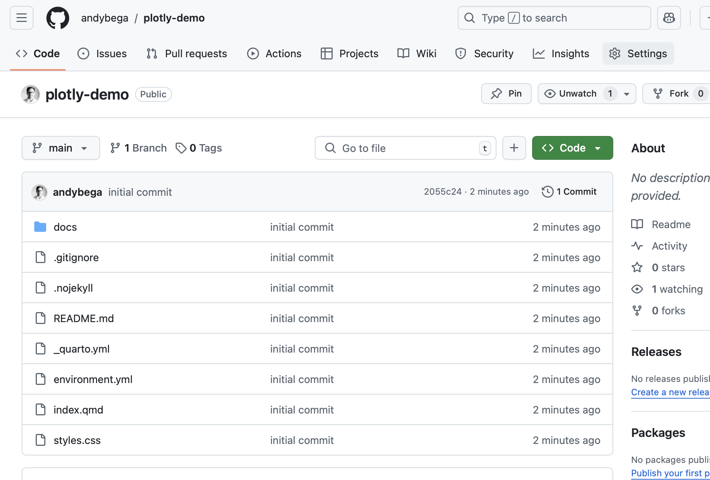
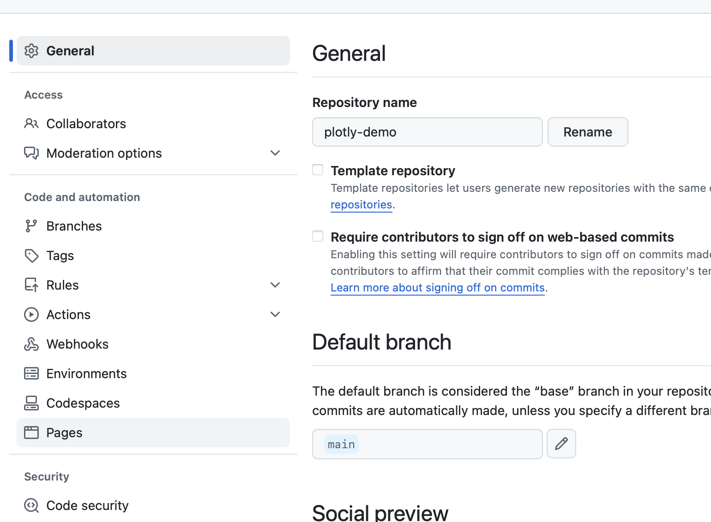
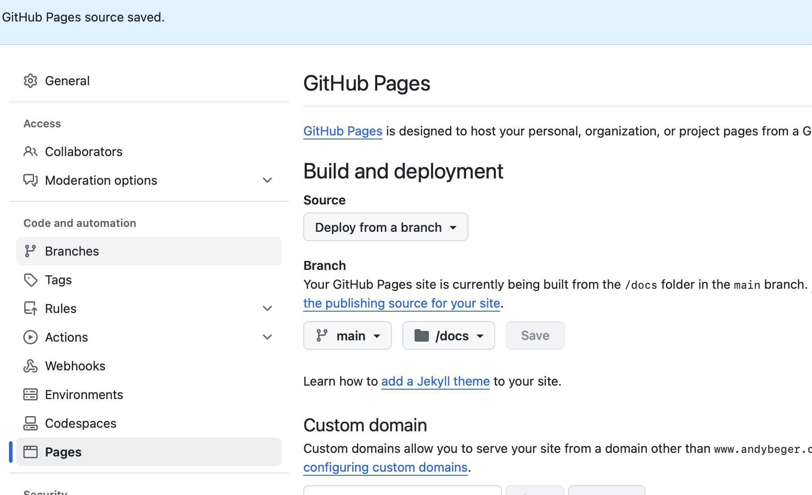

# plotly-demo

`index.qmd` has a Plotly example graph. 

This particular repo is published as a "project" page, and thus will show up as a subfolder: [https://andybega.github.io/plotly-demo](https://andybega.github.io/plotly-demo). If you don't have a repo named `<username>.github.io`, try this out in a repo with that name. 

Note the `.nojekyll` file here and also in `docs/` (not sure it's required in both).

1. `quarto render` -> writes html file to `docs/`
2. Publish/sync to GitHub
3. Change the repo settings to set up Pages (one time only)

Set to publish from the main brach, using the `docs/` folder:

